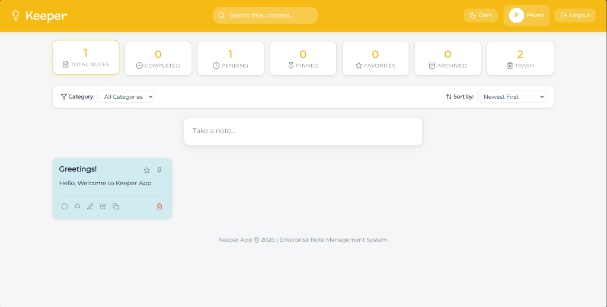
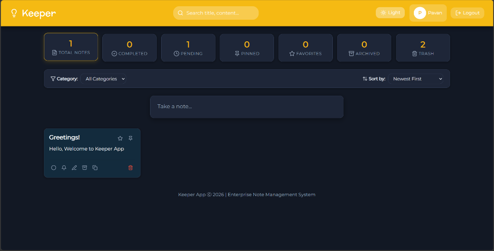
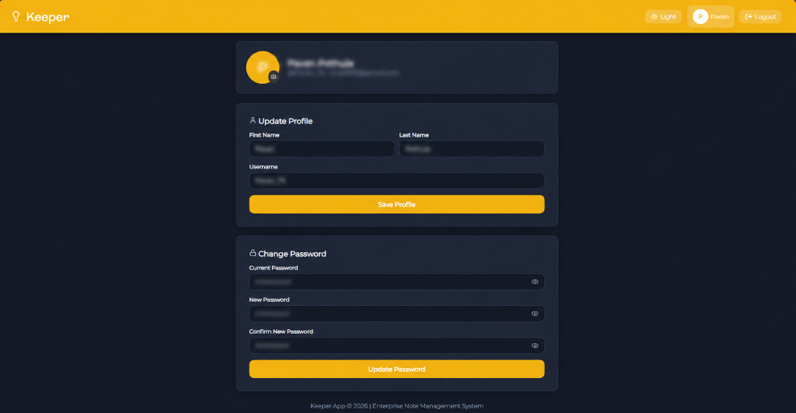
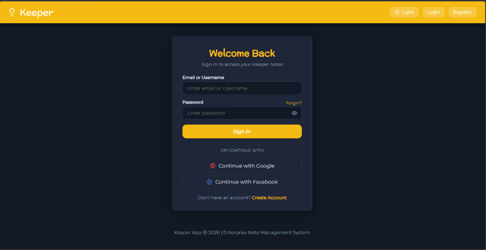

# Keeper App - Enterprise Full-Stack Note Management System

An enterprise-grade, full-stack production application built on top of the classic Keeper App. Features comprehensive JWT & OAuth2 authentication (Google & Facebook), PostgreSQL relational database storage, live audio reminders with on-screen ringing alarms and snooze, 30-day automatic trash purge, note categorization, tagging, searching, filtering, stats dashboard, profile management, and glassmorphic light/dark theme modes.

---

## 📸 Screenshots Overview

| Light Mode Dashboard | Dark Mode Dashboard |
| :---: | :---: |
|  |  |

| Profile & Password Management | Authentication & Social OAuth |
| :---: | :---: |
|  |  |

---

## 🚀 Key Features

### 🔐 Authentication & Security
- **Multi-Method Login**: Login using **Email + Password** OR **Username + Password**.
- **Social OAuth2 Integration**: 1-Click login & auto account creation via **Google** and **Facebook** powered by Passport.js.
- **Password Visibility Toggle**: Interactive **Eye / EyeOff** toggle button to show or hide passwords on Login, Register, Reset Password, and Change Password forms.
- **Autofill Protection**: Disabled automatic browser credential autofill to protect user privacy.
- **JWT Token Management**: Short-lived Access Tokens (15m) + Secure HTTP-only Refresh Tokens (7d).
- **Password Security**: Passwords hashed using **bcrypt** with 12 salt rounds.
- **Complete Auth Flow**: Login, Register, Forgot Password, Reset Password with token link, Email Verification.
- **User Data Isolation**: Logged-in users can only access their own private notes.

### 📝 Smart Notes & Management
- **Rich Note Content**: Title, Content, Background Colors, Pin, Archive, Trash, Favorite, Mark as Done/Pending.
- **Auto-Collapse & Auto-Save**: Clicking outside the "Take a note..." area auto-saves your note if text is entered, or collapses the form if empty. Includes a top-right **"✕"** cross button.
- **Clean Note Duplication**: 1-click note duplication preserving original note titles without appending `(Copy)` text.
- **Categories & Tags**: Group notes into custom user categories and tag with custom labels.
- **Instant Search**: Search across note title, content, category name, or labels.
- **Filters & Sorting**:
  - **Filters**: Total, Completed, Pending, Pinned, Favorites, Archived, Trash.
  - **Sorting**: Newest First, Oldest First, Alphabetical (A-Z), Reminder Date.

### 🔔 Reminders & Live Alarms
- **Date & Time Scheduling**: Schedule exact date & time reminders for notes.
- **Web Audio API Synthesizer Tones**: Choose between 5 customizable notification sounds (*Chime*, *Bell*, *Digital*, *Alarm*, *Wave*).
- **Native Desktop Notifications**: Automatically requests browser system notification permission (`Notification.requestPermission()`) for system popups.
- **Live On-Screen Alarm Popup Modal**: Real-time checking (every 3s) pops up a live **Alarm Alert Window** when a reminder time is reached, complete with **Snooze (5m)** and **Dismiss Alarm** buttons.
- **Easy Remove Reminder**: 1-click **"🗑️ Remove Reminder"** button inside the reminder modal.

### 🧹 Automatic Trash Cleanup
- **30-Day Auto-Purge Worker**: Background worker runs on server startup and every 12 hours to automatically permanently delete notes in Trash older than 30 days (`updated_at < NOW() - INTERVAL '30 days'`).
- **Zero SQL Schema Alterations**: Utilizes existing database schema timestamps.

### 🎨 Frontend UI & Glassmorphic Aesthetics
- **Glassmorphic Modal System**: Full-screen blurred backdrop (`backdrop-filter: blur(8px)`, `z-index: 9999`) mounted at `document.body` level via `ReactDOM.createPortal`. Completely blocks background navigation clicks and prevents page crashes.
- **High-Contrast Dark Mode Palette**: Customized dark-mode note card colors (`#1e2638`, `#332712`, `#163320`, `#132b3d`, `#3d1a24`, `#291b3b`) ensuring text is crisp, sharp, and 100% visible in Light & Dark modes.
- **Responsive Dashboard**: Stats overview cards displaying counts for total, completed, pending, pinned, favorites, archived, and trash notes.
- **Profile Management**: Update display name, username, password, and upload custom profile pictures with live preview.

### 🛡️ Security & Enterprise Best Practices
- **PostgreSQL Database**: Parameterized queries using `node-postgres` (`pg`) to prevent SQL Injection.
- **API Security**: Express Rate Limiter, Helmet headers, CORS policies, Cookie Parser, Express Validator input sanitization.
- **MVC Architecture**: Backend clean separation into Controllers, Models, Routes, Middlewares, Config, Database, Services, Utils.

### 🐳 Docker & Containerization
- **1-Command Deployment**: Full multi-container orchestration (`docker compose up --build -d`).
- **Nginx Web Server**: Multi-stage Vite React build served with high-performance Nginx and built-in API reverse proxy.
- **Local & Container DB Support**: Seamless host database bridge (`host.docker.internal`) sharing PostgreSQL state between Docker and host dev environment.

---

## 🛠️ Tech Stack

- **Frontend**: React.js, HTML5, CSS3, Lucide Icons, Web Audio API, Vite.
- **Backend**: Node.js, Express.js.
- **Database**: PostgreSQL (node-postgres `pg` pool).
- **Authentication**: JWT, bcrypt, Passport.js (Google & Facebook OAuth2).
- **Containerization & Deployment**: Docker, Docker Compose, Nginx Reverse Proxy.
- **Security & Utils**: Helmet, CORS, Morgan, Express Rate Limit, Express Validator, Multer, Nodemailer, Cookie Parser.

---

## 📁 Project Folder Structure

```
Keeper App/
├── backend/
│   ├── config/
│   │   ├── db.js              # PostgreSQL Connection Pool
│   │   └── passport.js        # Google & Facebook OAuth Strategies
│   ├── controllers/
│   │   ├── authController.js  # JWT Auth & Password reset logic
│   │   ├── noteController.js  # Note CRUD & Stats logic
│   │   ├── categoryController.js
│   │   ├── reminderController.js
│   │   └── userController.js  # Profile & Avatar upload logic
│   ├── database/
│   │   ├── schema.sql         # SQL DDL CREATE TABLE statements
│   │   └── initDb.js          # DB auto-initialization script
│   ├── middlewares/
│   │   ├── authMiddleware.js  # JWT token verification
│   │   ├── validationMiddleware.js
│   │   ├── uploadMiddleware.js# Multer avatar upload
│   │   ├── rateLimiter.js     # Rate limiting middleware
│   │   └── errorHandler.js    # Express error handler
│   ├── models/
│   │   ├── User.js            # User DB Model (pg)
│   │   ├── Note.js            # Note DB Model (pg) with 30-day trash cleanup
│   │   ├── Category.js
│   │   ├── Reminder.js
│   │   └── OAuth.js
│   ├── routes/
│   │   ├── authRoutes.js
│   │   ├── noteRoutes.js
│   │   ├── categoryRoutes.js
│   │   ├── reminderRoutes.js
│   │   └── userRoutes.js
│   ├── services/
│   │   └── emailService.js    # Nodemailer email sender
│   ├── utils/
│   │   ├── jwtUtils.js
│   │   └── responseUtils.js
│   ├── uploads/               # User uploaded avatars
│   ├── .dockerignore          # Docker ignore rules for backend
│   ├── Dockerfile             # Express Node.js backend Dockerfile
│   ├── package.json
│   └── server.js              # Main Express Server & background workers
├── public/
│   ├── screenshots/           # Application Screenshots
│   │   ├── dashboard-light.png
│   │   ├── dashboard-dark.png
│   │   ├── profile-dark.png
│   │   └── login-dark.png
│   └── styles.css             # Theme tokens, dark mode & glassmorphic modal CSS
├── src/
│   ├── components/
│   │   ├── Auth/              # Login, Register, Forgot/Reset Password, Verify
│   │   ├── Profile/           # Profile & Avatar management
│   │   ├── App.jsx            # Main React layout
│   │   ├── Header.jsx
│   │   ├── Footer.jsx
│   │   ├── Note.jsx           # Note card with Portal Edit dialog
│   │   ├── CreateArea.jsx     # Note creator with auto-collapse & auto-save
│   │   ├── DashboardStats.jsx
│   │   └── ReminderModal.jsx  # Portal Reminder modal with sound tones
│   ├── context/
│   │   ├── AuthContext.jsx
│   │   ├── ThemeContext.jsx
│   │   └── NotesContext.jsx   # Live 3s alarm checker & portal alarm popup
│   ├── services/
│   │   └── api.js             # API client with auto-token refresh
│   ├── utils/
│   │   ├── audio.js           # Web Audio API Synthesizer (Chime, Bell, Digital, Alarm, Wave)
│   │   └── themeUtils.js      # High contrast light/dark mode color mapper
│   └── main.jsx
├── .dockerignore              # Docker ignore rules for frontend
├── .env                       # Environment variables
├── .env.example
├── .gitignore
├── docker-compose.yml         # Multi-container orchestration (Backend + Frontend)
├── Dockerfile                 # Multi-stage Vite React frontend Dockerfile
├── nginx.conf                 # Nginx web server & API reverse proxy configuration
├── package.json
└── README.md
```

---

## ⚙️ Installation & Setup

### 1. Prerequisites
- **Node.js** (v18 or higher)
- **PostgreSQL** Database installed and running

### 2. Environment Configuration
Create a `.env` file in the root directory (or copy `.env.example`):

```env
PORT=5000
NODE_ENV=development
CLIENT_URL=http://localhost:5173

# PostgreSQL Connection
PGHOST=localhost
PGPORT=5432
PGUSER=postgres
PGPASSWORD=your_pg_password
PGDATABASE=keeper_db

# JWT Secrets
JWT_SECRET=super_secret_keeper_access_key
JWT_EXPIRES_IN=15m
JWT_REFRESH_SECRET=super_secret_keeper_refresh_key
JWT_REFRESH_EXPIRES_IN=7d

# OAuth Keys
GOOGLE_CLIENT_ID=your_google_client_id
GOOGLE_CLIENT_SECRET=your_google_client_secret
FACEBOOK_APP_ID=your_facebook_app_id
FACEBOOK_APP_SECRET=your_facebook_app_secret

# SMTP Email Configuration (Optional - falls back to console logs)
SMTP_HOST=smtp.gmail.com
SMTP_PORT=587
SMTP_USER=your_email@gmail.com
SMTP_PASS=your_app_password
EMAIL_FROM=Keeper App <no-reply@keeperapp.com>
```

### 3. Database Setup
Create the database in PostgreSQL:
```sql
CREATE DATABASE keeper_db;
```
Run the schema initialization script:
```bash
cd backend
npm install
npm run db:init
```

### 4. Running the Backend Server
```bash
cd backend
npm run dev
```
*Backend server will start at `http://localhost:5000`*

### 5. Running the Frontend App
In a new terminal window:
```bash
npm install
npm run dev
```
*Frontend application will start at `http://localhost:5173`*

---

## 🐳 Docker Setup & Running with Docker Compose

Keeper App is fully containerized using Docker and Docker Compose for effortless 1-command deployment including **React (Nginx)** and **Express Node.js Backend**, seamlessly connecting to your PostgreSQL database and Google/Facebook OAuth configuration.

### Prerequisites
- [Docker Desktop](https://www.docker.com/products/docker-desktop/) installed and running on your system.

### Quick Start with Docker Compose

1. **Configure Environment**: Ensure your root `.env` file contains your database credentials and OAuth keys (see `.env.example`).

2. **Build & launch containers**:
   ```bash
   docker compose up --build -d
   ```

3. **Verify services are running**:
   ```bash
   docker compose ps
   ```
   You will see 2 active containers:
   - `keeper_backend` (Express API Server on port 5000, connected to PostgreSQL via `host.docker.internal`)
   - `keeper_frontend` (Vite React App served via Nginx on port 5173 with API reverse proxy)

4. **Access the application**:
   - **Frontend App**: Open [http://localhost:5173](http://localhost:5173)
   - **Backend API Health Check**: Open [http://localhost:5000](http://localhost:5000)

5. **Useful Docker Commands**:
   - **View Live Backend Logs**:
     ```bash
     docker compose logs -f backend
     ```
   - **Stop Container Stack**:
     ```bash
     docker compose down
     ```

---

## 🔑 OAuth Setup Guide

### Google OAuth2
1. Go to [Google Cloud Console](https://console.cloud.google.com/).
2. Create a Project -> Enable OAuth 2.0 API.
3. Add Authorized Redirect URI: `http://localhost:5000/api/auth/google/callback`.
4. Copy `Client ID` and `Client Secret` into `.env`.

### Facebook OAuth2
1. Go to [Facebook Developers](https://developers.facebook.com/).
2. Create App -> Setup Facebook Login.
3. Add Valid OAuth Redirect URI: `http://localhost:5000/api/auth/facebook/callback`.
4. Copy `App ID` and `App Secret` into `.env`.

